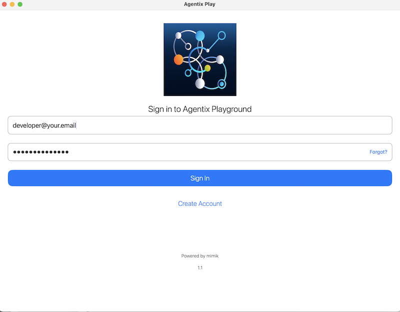
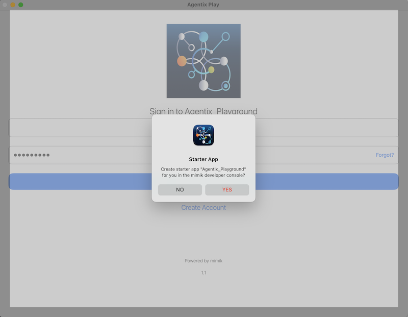
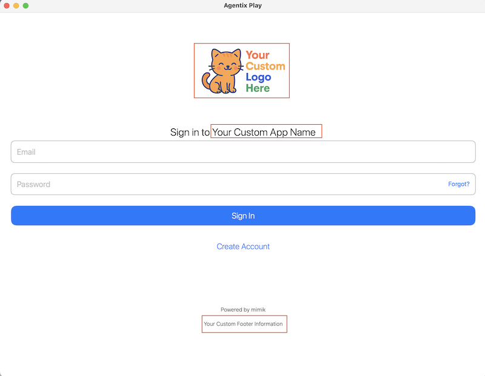

# Objective

The **Agentix Playground** is a sample iOS app that demonstrates how to integrate **mimik AI** into your iOS projects. It allows you to download and run language models directly on your device—enabling powerful, private, offline-capable AI through a hybrid edge-cloud architecture.

The app also supports activating online services (e.g., **Google Gemini**) and using them for prompt generation or response validation. You can mix and match on-device and cloud services as needed.

When running on **Apple Silicon Macs**, the app unlocks additional capabilities such as support for **Vision-Enabled Language Models**. You can upload images and receive intelligent visual feedback—within the same Swift-based codebase.

The latest versions now include:

- **Built-in authentication** with your [mimik Developer Console](https://console.mimik.com) account.  
- **Automatic token retrieval** after login (no manual copy/paste).  
- **Automatic project creation** (“Agentix Playground”) in your Developer Console (with approval).  
- For developers compiling from source: runtime license setup and customization remain available.  

This example is built using **ClientLibrary** and **ClientRuntime**, part of the **mimik Client Library v5.10.0**. This unified abstraction layer simplifies working with AI models across device, edge, and cloud environments, supporting real-time streaming and discovery.


# Why this platform matters

| For Developers (Powerful) | For Managers (Magical) |
|----------------------------|-------------------------|
| **Single code path** – Interact with both on-device and cloud-hosted AI models using the same API, reducing branching logic and simplifying maintenance. | **One simple workflow** – Build once, and your app taps into both on-device and cloud AI without extra effort. |
| **Composable model execution** – Chain on-device and online models together for validation, fallback, or multi-step inference without writing custom glue code. | **Smarter together** – Seamlessly combine the strengths of local and online AI for faster, more reliable results. |
| **Offline-first on-device models** – Local models run without any network dependency, no background telemetry, and no data leaving the user’s phone. | **Always available offline** – On-device AI keeps working with no internet required and no hidden data sharing. |
| **Privacy by default** – On-device inference is fully local; no hidden telemetry or background data transfer. | **Built-in trust** – User data stays private by default, making compliance and customer confidence effortless. |
| **Vision VLM support** – Natively run and integrate vision-language models for multimodal apps (image + text understanding) without custom hacks. | **Next-gen AI experiences** – Power products with image + text intelligence, from smart assistants to rich content understanding. |
| **Capabilities beyond Apple’s APIs** – Provides features not supported by Core ML or Apple’s frameworks (e.g., direct chaining of heterogeneous models, hybrid execution strategies). | **Unleashes new possibilities** – Unlocks capabilities that Apple’s tools don’t allow, giving your product a competitive edge. |


# Getting Started

> 🆕 **Authentication with your mimik Developer Console account is now required** when the app launches.  
> The built-in UI flow will guide you through signing up or logging in.  
>  
> ⚠️ Vision-enabled features are available **only** on Apple Silicon Macs.  

---

> ## 🚀 Option 1: Try It with TestFlight  
> Prefer not to build the app yourself?  
>  
> 1. Open [this TestFlight link](https://testflight.apple.com/join/qoSKwIAE) on your iOS device.  
> 2. Accept the invitation and install the app.  

---

> ## 🛠️ Option 2: Compile It Yourself  
> **Prerequisites**  
> - You **must use a physical iOS device** connected to your Mac.  
>   > The iOS Simulator is **not supported** due to native dependencies.  
> - Alternatively, you can run the app on an **Apple Silicon Mac**.  


---

# Get the Code

Clone the project and open it in Xcode:

```bash
git clone https://github.com/mimikgit/mimik-ai-agentix-playground-example-iOS.git
```

---

# Install Dependencies (CocoaPods)

The project uses two custom CocoaPods:

- [EdgeCore](https://github.com/mimikgit/cocoapod-EdgeCore)  
- [mim-OE-ai-SE-iOS-developer](https://github.com/mimikgit/cocoapod-mim-OE-ai-SE-iOS-developer)

These are already declared in the `Podfile`.

### Step 1: Navigate to the Source Directory

```bash
cd mimik-ai-agentix-playground-example-iOS/Source/
```

### Step 2: Install Pods

```bash
pod install --repo-update
```

---

# Configure Runtime Credentials

> 🆕 **Developer ID Tokens are retrieved automatically** after login.  
> Manual copy/paste of `config-developer-id-token` is no longer required.

### Runtime License

- For **TestFlight builds**, the runtime license is **built in automatically**.  
- For **source builds**, you must still copy/paste your runtime license manually from [developer console](https://console.mimik.com):  

```bash
open config-developer-runtime-license
```

> This step will be automated in a future release with a new API call.  
> [Developer console tutorial](https://devdocs.mimik.com/tutorials/01-submenu/01-submenu/02-index)

### API Key

```bash
open config-developer-api-key
```

Paste your API key to authenticate specific app calls if needed.  

### Model Configurations

```bash
open Model-Configs/config-model-04-gemma2b.json; open Model-Configs/config-model-05-gemma11.json
```

These JSON files define model download URLs and settings. You can leave them as-is unless you're customizing models.

---

# Launch in Xcode

Open the workspace:

```bash
open mimik-agentix.xcworkspace
```
 And run on either a **physical iOS device** or **Apple Silicon Mac**.

---

# Running the Example on Devices

## iOS Devices

**Connect a physical iOS device** and select it in Xcode as the run target. For optimal performance, use a device capable of running AI models. Simulator is not supported.

Run the app and follow the on-device prompts to continue.

> ⚠️ iOS Simulators are not supported, use a physical device.


## Apple Silicon Macs

Apple Silicon Macs can run iOS apps natively on macOS, including the iOS mim OE binary.

Select **My Mac (Designed for iPad)** in Xcode as the run target.

Run the app and follow the on-device prompts to continue.

> 📚 Learn more: [Adapting iOS code to macOS (Apple Silicon)](https://developer.apple.com/documentation/apple-silicon/adapting-ios-code-to-run-in-the-macos-environment)

---

# Getting Started in the App

After launching the app, you’ll first be prompted to **sign in with your mimik Developer Console account**.

- Options include **Sign in**, **Sign up**, or **Reset Password**.  
- A new project (**Agentix Playground**) can be automatically created in your Developer Console (after user approval).  
- Authentication is required on every app relaunch.  
  > Developers compiling from source may extend the code to persist login if desired.

  
  

Once logged in, tap the **START HERE** button.


---

# Assistant Prompt Service Setup

To start, you'll download an on-device model and set it as the **Prompt Service**.

> Later, you'll use another service (e.g., Gemini) as the **Validation Service** for hybrid workflows.

### Download a Language Model

Tap **Add On-Device Models** in the system menu.


You’ll see two model presets:

- `gemma-v2-2b` (recommended)  
- `gemma-v1.1-2b`  

These models are defined in:

- `config-model-04-gemma2b.json`  
- `config-model-05-gemma11.json`  

Select `gemma-v2-2b`, then tap **START DOWNLOAD**.


> 💡 On Apple Silicon Macs, five models will be listed, including a Vision-Enabled model.


---

### Monitor Download Progress


**Tips:**
- Keep the app active and the screen awake.  
- Use the button to cancel at any time.  

---

# Chat with the Prompt Service

Once the model is ready, a `>` prompt appears for chatting with the on-device assistant.


Type your query, and the assistant will stream its response in real time.

 

- Tap a button to stop a response mid-stream.  
- The app displays token throughput after each response.  

---

## Context-Aware Conversations

The assistant maintains session context across prompts for more natural, coherent interactions.

  

Manage the conversation with:

- **Clear** – resets the chat history.  
- **Copy** – saves the conversation to clipboard.  

---

## Vision-Enabled Models (Mac Only)

On Apple Silicon Macs, Vision Language Models allow image input with descriptive feedback.

> ❗ Vision models **do not support** multi-turn chat or context chaining.

  
  
  


---

# Assistant Validation Service

To demonstrate hybrid AI workflows, you’ll set up **Google Gemini** as the Validation Service to verify responses from on-device models.

### Activate Google Gemini

1. Tap **Activate Services**, then choose **Gemini**.  
2. Enter your **Google Gemini Developer API Key**.  
3. Tap **Connect** to activate the service.  

### Notes:

- Google Gemini is the only supported online validation service (for now).  
- You must provide your own Gemini API key.  
- Contextual chaining is disabled while online services are active.  
- Online responses do **not** include token throughput stats.  

  
  
  
  


---

# Settings Menu

Access app settings via the gear icon:

- **Add On-Device Models** – Download new models.  
- **Remove On-Device Models** – Delete existing model files.  
- **Erase All Content** – Reset the app and delete all models.  
- **Deactivate Services** – Disconnect from online services.  

  


### View Available Models

Tap **List Models** at the bottom of the screen to view all available models (on-device and online).

  


---

## Works Fully Offline

Once a model is downloaded, the app functions 100% offline—even in airplane mode.

> Ensure downloads are complete before disconnecting from the internet.

---

## Mix & Match On-Device and Online Services

Once you have at least one on-device model and one active online service, you can:

- Choose either as the **Prompt** or **Validation** service.  
- Use the **swap** button to quickly exchange the two.  

---

# Developer Customization (Source Builds)

If you are compiling from source, you can customize the automatically created project:

- Change the application name  
- Update the logo  
- Modify the description string shown at the login screen  



---

# Codebase Updates

The app is now built on the latest **mimik ClientLibrary v5.10.0**, which brings:  

- `async/await` for asynchronous operations  
- Throwing functions for error handling  
- Cleaner, simplified function signatures  

### Migration Summary
- **EdgeClient → ClientLibrary**  
- **EdgeEngineClient → ClientRuntime**  
- **EngineService → RuntimeService**  


---

# Additional Resources

Learn more about iOS + mimik AI integration:

- [Understanding the mimik Client Library for iOS](https://devdocs.mimik.com/key-concepts/10-index)  
- [Creating a Simple iOS App with Edge Microservices](https://devdocs.mimik.com/tutorials/01-submenu/02-submenu/01-index)  
- [Integrating mimik into an iOS Project](https://devdocs.mimik.com/tutorials/01-submenu/02-submenu/02-index)  
- [Working with Edge Microservices in iOS](https://devdocs.mimik.com/tutorials/01-submenu/02-submenu/04-index)  
- [Using AI Models in iOS](https://devdocs.mimik.com/tutorials/02-submenu/02-submenu/01-index)  
